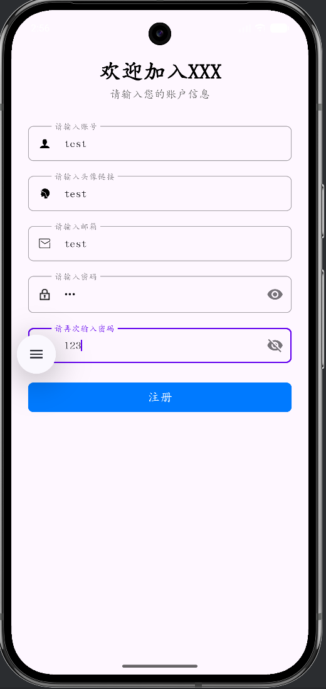
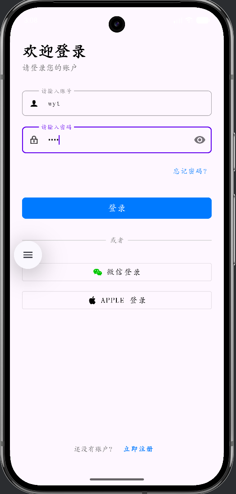
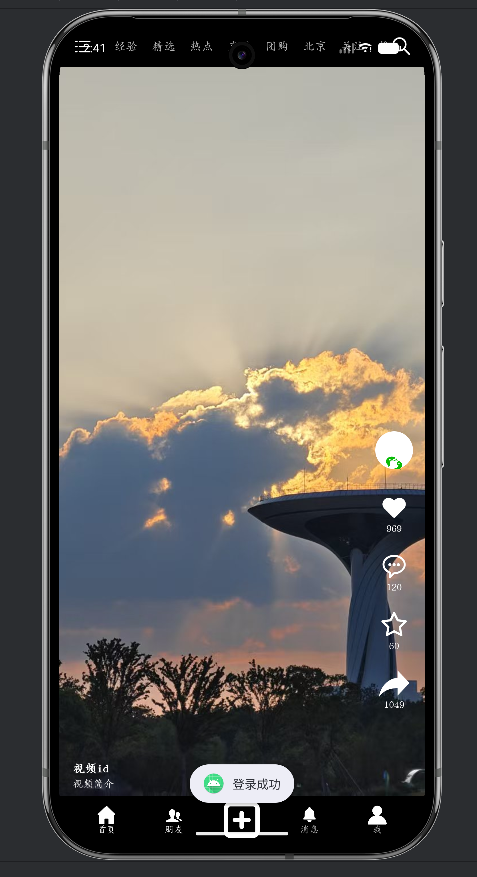
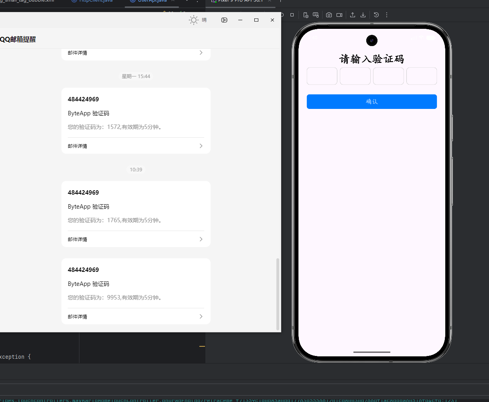
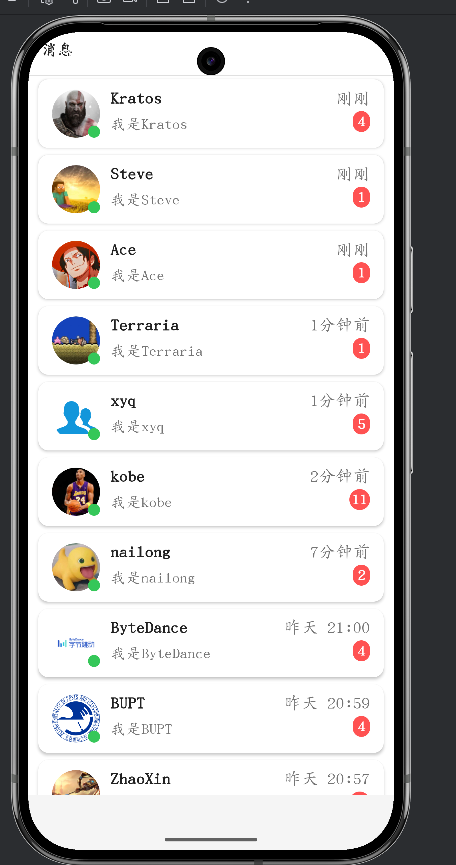
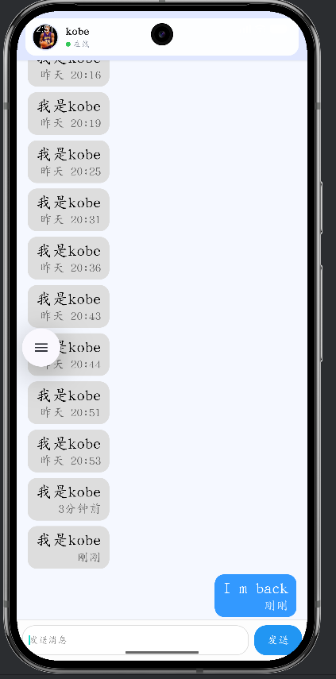
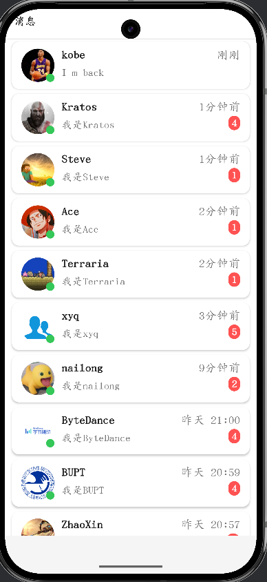

# 即时通讯App - 客户端技术文档

## 1. 简介

本文档详细阐述了本次大作业客户端的架构设计、功能实现、关键技术点及开发过程中遇到的挑战与解决方案。该应用实现了用户认证、实时消息收发、数据持久化与自定义功能等核心模块。

> **测试账户说明**
>
> 请使用以下 Demo 账户进行功能测试：
> *   **用户名**: `wyt`
> *   **密码**: `123`
> *   **特别注意**: 因后端消息轮询的接收账户被硬编码 (Hardcode) 为 `wyt`，测试时必须使用此账户登录，才能验证消息的接收功能。

## 2. 交付信息

| 项目             | 内容                                                         |
| :--------------- | :----------------------------------------------------------- |
| **交付项**       | 客户端训练营 - 课程项目 - 仿抖音消息功能                     |
| **产物地址**     | https://github.com/xyq257/ByteDanceApp.git                   |
| **代码运行截图** |        |

## 3. 实现的功能列表

### 3.1 基础与进阶功能 (按课程要求)

| 要求类别       | 功能点                     | 实现情况                                                     |
| :------------- | :------------------------- | :----------------------------------------------------------- |
| **基础要求 1** | **工程环境与架构**         | **✔已完成。** 基于 **MVC** 分层架构搭建工程，采用 **Java 开发： • **分层设计**： &emsp;- **表现层 (`activity`)**：按业务模块拆分为 `user`(鉴权)、`message`(列表)、`chat`(会话) 等包，逻辑清晰。 &emsp;- **网络层 (`remote`)**：`Http` 包封装 Retrofit/OkHttp 请求，`socket` 包独立封装 WebSocket 长连接管理。 &emsp;- **数据层 (`Database`)**：通过 `UserDbHelper` 与 `User` 实体类实现 SQLite 本地数据库的 CRUD 操作。 • **环境配置**：Target SDK 36，适配最新 Android 特性，使用 Gradle 统一管理依赖。 |
| **基础要求 2** | **消息列表页 (UI & 数据)** | **✔ 已完成**。实现了消息列表的完整功能，包括：  • **UI 层面**: 采用`RecyclerView`构建消息列表UI，每个Cell清晰地展示了**头像、昵称、消息摘要、时间和未读数角标**。  • **数据层面**: 应用启动时，首先从本地SQLite数据库加载历史会话，实现**离线可读**。同时通过WebSocket实时接收新消息并更新列表。 |
| **基础要求 3** | **备注页**                 | **✔ 已完成**。点击任意会话即可进入备注页，实现了：  • **昵称展示**: 页面顶部清晰展示当前联系人的原始昵称。  • **备注编辑**: 提供`EditText`输入框，允许用户自由编辑备注名。  • **持久化存储**: 点击“保存”后，备注信息通过`UserDbHelper`**持久化到SQLite数据库的`conversations`表中**。  • **数据回显**: 从备注页返回会话列表后，列表项会**优先显示已保存的备注名**。 |
| **基础要求 4** | **本地持久化**             | **✔ 已完成**。应用的核心数据均实现了本地持久化：  • **未读状态**: 每个会话的未读消息数`unread`存储在`conversations`表中，新消息到来时递增，进入聊天页后清零。  • **本地备注**: 用户设置的备注`remark`存储在`conversations`表中。  • **冷启动一致性**: 关闭并重新打开App后（冷启动），所有会话列表、未读数、备注和头像信息均能从本地数据库恢复，与上次操作保持一致。 |
| **进阶功能 1** | **本地消息中心模拟**       | **✔ 已完成**。通过**全局单例`WebSocketManager`** 实现了消息中心功能：  • **消息分发**: `WebSocketManager`作为唯一的消息源，接收到服务器推送的消息后，通过**观察者模式**将消息分发给所有已注册的监听者（如`MessageActivity`和`ChatActivity`）。  • **消息进入时触发**:   &nbsp;&nbsp;&nbsp; - **列表实时刷新**: `MessageActivity`监听到新消息后，会更新对应会话的摘要、时间和未读数，并重新排序，将最新会话置顶。  &nbsp;&nbsp;&nbsp; - **聊天页动态插入**: `ChatActivity`监听到属于当前对话的新消息时，会将其动态插入到`RecyclerView`底部，并平滑滚动到底部。 **• 后端消息存储更新：** 实现了APP本地卸载/更换手机导致本地缓存消除时从后端数据库提取消息并更新 |
| **进阶功能 3** | **消息时间文案规则**       | **✔ 已完成**。通过自定义工具类`TimeUtils`，实现了与要求完全一致的友好时间格式化规则：  • 1分钟内: 显示**“刚刚”**。  • 1小时内: 显示**“xx分钟前”**。  • 今天内: 显示**“HH:mm”**格式的时间。  • 昨天: 显示**“昨天 HH:mm”**。  • 其他: 对于更早的消息，实现了如“MM-dd”或“yyyy-MM-dd”的格式。 |
| **进阶功能 6** | **SQLite Migration**       | **✔ 已完成**。在`UserDbHelper`中实现了**非破坏性的数据库迁移 (Migration)**：  • **Schema升级**: 通过递增`DB_VERSION`并重写`onUpgrade`方法来管理数据库版本。  • **保留旧数据**: `onUpgrade`方法采用`ALTER TABLE ... ADD COLUMN ...`语句为`conversations`表添加`remark`列，而不是`DROP TABLE`，确保了在App更新后，用户的**历史聊天记录和会话数据能够被完整保留**。 |

### 3.2 自由探索功能

#### 完整的用户认证系统 (按 Activity 拆分)

| 功能模块                                          | 核心流程与实现细节                                           | 关键技术点                                                   |
| :------------------------------------------------ | :----------------------------------------------------------- | :----------------------------------------------------------- |
| **用户注册 (`RegisterActivity`)**                 | 1.  **UI交互**: 用户在界面输入**账号、邮箱、密码、头像URL**等信息。 2.  **前端校验**: 对用户输入进行非空和密码一致性校验，提升用户体验。 3.  **API调用**: 调用`UserApi.register()`将注册信息异步发送至后端服务器。 4.  **本地持久化**: 注册成功后，调用`dbHelper.insertUser()`在本地`user`表中创建一条新记录，存储用户的账号、邮箱和头像URL，此时`token`字段为空。 | • **前后端分离**: 注册核心逻辑由后端处理，客户端负责数据采集和结果反馈。 • **数据预存**: 提前在本地创建用户记录，为后续登录更新`token`和查询用户信息（如头像）做准备。 |
| **用户登录 (`LoginActivity`)**                    | 1.  **凭证提交**: 用户输入账号和密码，调用`UserApi.login()`发送凭证至后端。 2.  **JWT接收**: 后端验证凭证成功后，生成并返回一个包含用户身份信息的**JWT (JSON Web Token)**。 3.  **Token持久化**: 客户端在`onSuccess`回调中接收到JWT，立即调用`dbHelper.updateUserInfo()`将其更新到本地`user`表的`token`列。 4.  **状态保持**: 将当前登录的`account`存入`SharedPreferences`，作为全局当前用户标识。 | • **JWT鉴权**: 采用无状态的JWT作为核心认证机制，客户端在后续请求中携带此Token。 • **安全存储**: 客户端**不存储用户密码**，只存储有时效性的、由服务器签发的Token，更加安全。 • **自动登录**: 应用冷启动时，通过读取本地Token来恢复用户登录状态。 |
| **忘记密码 - 步骤1 (`ForgetPasswordActivity`)**   | 1.  **邮箱输入**: 用户输入注册时使用的**邮箱地址**。 2.  **请求发送**: 客户端调用`UserApi`的相关接口通知后端。 3.  **邮件服务**: 后端服务器生成一个**随机、有时效性**的验证码，并通过集成的邮件服务将其发送到用户指定的邮箱。 | • **身份验证**: 通过向用户邮箱发送验证码，确保只有邮箱的合法所有者才能发起密码重置请求。 • **安全性**: 验证码的**时效性**设计可以有效防止暴力破解和旧码重用。 |
| **忘记密码 - 步骤2 (`ResetPasswordActivity`)**    | 1.  **验证码输入**: 用户在收到邮件后，在此页面输入收到的验证码。 2.  **后端校验**: 客户端将邮箱和验证码提交给后端进行校验。 3.  **凭证交换**: 验证通过后，后端返回一个**一次性的、短时效的“重置密码凭证”**，并自动导航至下一步。 | • **流程隔离**: 将验证码校验作为一个独立步骤，确保只有通过验证的用户才能进入最终的密码设置环节。 • **凭证安全**: 一次性的重置凭证确保了该链接或Token在被使用一次后立即失效。 |
| **忘记密码 - steps 3 (`SetNewPasswordActivity`)** | 1.  **新密码输入**: 用户在此页面输入新的密码并进行确认。 2.  **最终重置**: 客户端将“重置凭证”和新密码提交给后端。 3.  **服务器端更新**: 后端验证凭证后，**在服务器数据库中安全地更新用户的密码哈希值**。 4.  **流程结束**: 客户端提示用户“重置成功”，并使用`Intent Flags`清空任务栈，将其导航回`LoginActivity`。 | • **职责明确**: **密码的哈希存储与更新完全由后端负责**，客户端不接触任何与密码相关的敏感逻辑。 • **良好体验**: 通过清空任务栈，防止用户在重置密码后按返回键回到错误的流程页面。 |
| **网络图片加载与缓存**                            | 1.  **技术选型**: 使用业界主流的图片加载库**`Glide`**。 2.  **头像显示**: 在会话列表和聊天详情页，从`user`表中读取用户的`photo` URL。 3.  **异步加载**: `Glide`负责从URL异步加载网络图片，并自动处理**图片缓存、圆形裁剪和占位图/错误图**的显示。 | • **高效图片库**: 利用`Glide`强大的缓存策略和生命周期管理，避免内存泄漏和重复下载。 • **UI/UX优化**: 通过设置占位图和圆形裁剪，使界面在图片加载过程中和加载完成后都保持美观。 |

## 4. 架构与关键设计思路

### 4.1 整体架构
- ### 系统分层架构设计

  本项目整体上采取了前后端分离架构，客户端采用经典的 Android 分层架构设计，各层职责明确，降低了模块间的耦合度：

  - **表现层 (Presentation Layer)**
    由 `Activity`、`Adapter` 及 XML 布局文件组成。该层专注于**UI 的构建与渲染**以及**用户交互事件的捕获**（如点击、输入），不包含复杂的业务判断逻辑，仅负责数据的展示与状态反馈。

  - **业务逻辑与控制层 (Business Logic & Control Layer)**
    采用 MVC 模式思想，由 `Activity` 充当控制器 (Controller)，配合功能单例（如 `AuthManager`, `WebSocketManager`）共同实现。
    - **Activity/Controller**: 负责协调 UI 层与数据层，调度异步任务。
    - **Manager Modules**: 封装核心业务规则，例如 `AuthManager` 负责身份校验逻辑，`WebSocketManager` 负责消息的分发策略与心跳机制。

  - **网络通信层 (Network Layer)**
    负责应用与后端服务器的数据交互，实现了双通道通信机制：
    - **HTTP 通道**: 通过 `UserApi` (基于 OkHttp/Retrofit 封装) 处理登录、注册等短连接请求。
    - **WebSocket 通道**: 通过 `WebSocketManager` 维护 TCP 长连接，处理实时消息的推送与接收。

  - **数据持久层 (Data Persistence Layer)**
    负责本地数据的存储与读取，以 `UserDbHelper` 单例为核心，基于 Android 原生 SQLite 数据库构建。该层对外提供统一的数据操作接口 (DAO)，屏蔽了底层的 SQL 语句细节，确保持久化数据的完整性。

### 4.2 关键设计思路

| 设计点             | 实现方式                                                     | 带来的优势                                                   |
| :----------------- | :----------------------------------------------------------- | :----------------------------------------------------------- |
| **前后端分离架构** | 后端基于 **Spring Boot** 提供 **RESTful API** 接口，使用 **JWT** 进行无状态身份认证；前端通过 HTTP/JSON 与后端交互，并利用 **WebSocket** 建立长连接通道。 | **解耦：** 明确职责边界，后端专注业务逻辑与数据持久化，前端专注 UI 交互，提升开发效率。 **扩展性：** 统一的 API 接口设计使得未来扩展 Web 端或 iOS 端时无需重构后端。 **轻量安全：** JWT 机制避免了服务端 Session 存储压力，更适合移动端环境。 |
| **消息中心**       | 通过**全局单例`WebSocketManager`** 和**观察者模式**实现。    | **解耦**: WebSocket的生命周期与任何单个Activity解耦，解决了跨页面消息同步和连接断开问题。 **高效**: 消息只需分发给当前活跃的监听者。 |
| **数据库管理**     | 采用**单例模式`UserDbHelper`**，持有唯一的`SQLiteDatabase`实例。 | **稳定**: 保证数据库连接的全局唯一，彻底避免了“连接池已关闭”的崩溃。 **线程安全**: 简化了多线程环境下的数据库访问。 |
| **UI渲染**         | 充分利用`RecyclerView`的**多视图类型 (`getItemViewType`)** 机制。 | **高效复用**: 使用一套Adapter即可高效渲染不同样式的聊天气泡（发送/接收），减少了代码冗余，提升了列表滚动性能。 |
| **数据查询**       | 在`loadAllConversations`中，使用**`LEFT JOIN`** SQL语句。    | **性能优化**: 在一次数据库查询中同时获取会话信息和对应的用户头像URL，避免了N+1查询问题，减少了数据库I/O次数。 |

## 5. 遇到的挑战与解决方案

| 问题描述                                                     | 根本原因                                                     | 解决方案                                                     |
| :----------------------------------------------------------- | :----------------------------------------------------------- | :----------------------------------------------------------- |
| **1. WebSocket 连接随 Activity 切换而断开**                  | WebSocket 的生命周期与 `MessageActivity` 错误地绑定。        | **架构重构**：引入**`WebSocketManager`单例**来全局管理连接，Activity作为监听者动态注册和注销，实现生命周期解耦。 |
| **2. 数据库操作导致`Connection Pool Closed`崩溃**            | 在“用完即关”的数据库模式下，`Cursor`还在使用时，其依赖的`SQLiteDatabase`连接被提前关闭。 | **架构重构**：将`UserDbHelper`改造为**单例模式**，确保`SQLiteDatabase`实例在应用生命周期内长久持有，避免了连接被意外关闭。 |
| **3.写xml文件的时候使用了android:background="@null导致无法在输入框复制粘贴** | 这个命令不仅去掉了背景，在某些 Android 版本或主题下，也同时移除了光标手柄`Cursor Handles`和文本选择手柄的样式引用 | **删了就行**                                                 |

**📂 附注：** 后端与前端相关的 SQL 数据库文件已上传至 Git 仓库。

